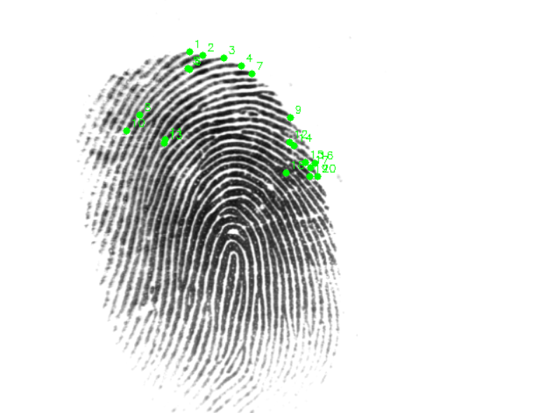
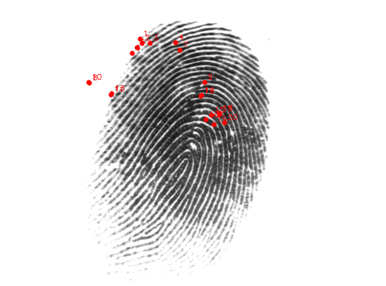

## Fingerprint Recognition System

<!-- OpenCV -->

<!-- PyTorch -->

<!-- scikit-image -->

<!-- SciPy -->

## Hybrid Fingerprint Matching with CNN & Classical Vision

This repository implements a hybrid fingerprint recognition system that combines:
convolutional Neural Network (Siamese CNN) for learned similarity,
minutiae extraction & matching for structural fingerprint features,
liveness detection to reject fake fingerprints,
visualization tools for matched minutiae and decision explanation.

The system processes fingerprint images, computes similarity scores, and produces human-interpretable match visualizations.

**Note:** If you want to see example outputs or visual results, check the screenshots/ directory or generate via running the system.

## General Information

Fingerprint recognition is essential in biometric authentication. This system:
Preprocesses fingerprint images (binarization, skeletonization),
extracts minutiae points (ridge endings & bifurcations),
computes structural similarity via point matching,
computes embedding similarity via a Siamese CNN,
fuses scores for robust identity decision,
detects liveness (points to potential spoof fingerprints),
visualizes matched features (top strongest matches).
This hybrid approach improves accuracy and interpretability compared to single-method systems.

## Features
## Feature Extraction

Skeletonization of fingerprint patterns
Local orientation & density scoring
Ending and bifurcation detection

**Liveness Detection**

Rejects fakes based on texture & frequency analysis

**Score Fusion and Decision Logic**

Weighted fusion:
final_score = 0.4 × CNN_score + 0.6 × Minutiae_score,
Ambiguity margin controls uncertain decisions,
Thresholding for acceptance / rejection.

**Visualization**

Two separate windows showing matched minutiae,
Top-20 strongest matches numbered and color-coded.

  
  

Left: Test fingerprint  
Right: Best-matching reference fingerprint with highlighted minutiae

**Requirements**

Ensure you have Python 3.10+, then create a virtual environment and install dependencies:

`python -m venv venv`                                                                                                     
`venv\Scripts\activate       # Windows`                                                                                              
`pip install -r requirements.txt`

Dependencies include:

OpenCV                                                                                   
PyTorch                                                                               
scikit-image                                                                       
SciPy

**Training the CNN**

To train the fingerprint similarity model:

`cd cnn
python train.py`

This will produce a model file (e.g., siamese_fingerprint.pth).

**Note:** Model weights are not included in the repository.

**Running Recognition**

To run the full recognition pipeline:

`python main.py`

Output will include:                                                           
Liveness score                                                             
Scores for each enrolled person                                            
Final decision (Accepted / Ambiguous / Rejected)                                 
Visualization of matched minutiae points

## How It Works                                                                                                          
## Minutiae Matching

Minutiae points are extracted and filtered. Matched pairs are found between test and reference prints. Top matched pairs show structural similarity.

**Siamese CNN**

Pairs of fingerprint images are embedded into a learned space. 
Similarity is computed as:

`score = 1 / (1 + euclidean_distance)`

**Score Fusion & Decision**

Final system decision is based on:
Weighted combination of CNN and structural scores
Threshold for valid identity
Gap margin to avoid ambiguous decisions
This design balances learned patterns and structural features.

**Use Cases**

Biometric authentication research,
academic demonstration of hybrid matching,
fingerprint liveness evaluation,
visual demonstration of matching.

**Limitations**

Not for production security systems
This project is for learning, experimentation, and prototyping.

**Contributing**

Feel free to open issues or pull requests.
For major changes, please discuss before submitting.

## Contact

If you have questions about this project, feel free to open an issue or contact the author.

